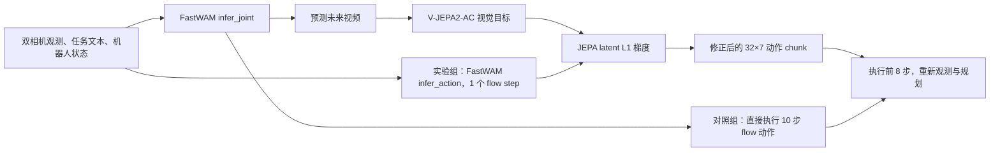

# LIBERO-Plus Long8：1 步 JEPA 与 10 步对照实验阶段报告

> **结果快照：2026-09-16 18:26:10（Asia/Shanghai）。本报告是进行中实验的静态快照。**
> 当时 64 个计划 episode 中有 18 个结果文件，均属于 10 步对照组；1 步 + JEPA 实验组尚未启动。因此下面的 8/18 不是两组成功率比较，不能用来判断 JEPA 的效果。后台启动器会在对照组完成后自动运行实验组。

## 1. 研究问题与实验口径

本实验比较两套完整的推理策略在 LIBERO-Plus Long Horizon 任务上的成功率、执行步数和推理耗时：

|  | 对照组 `ten_control` | 实验组 `one_step_jepa` |
|---|---|---|
| 未来视频生成 | FastWAM `infer_joint`，10 个 flow step | FastWAM `infer_joint`，1 个 flow step |
| 最终执行动作 | 同一次 `infer_joint` 输出，10 个 flow step | 另一次 `infer_action` 输出，1 个 flow step |
| V-JEPA2-AC | 不加载 | 加载 ViT-G encoder/predictor；在动作 flow step 0 后施加梯度 guidance |
| 动作候选数 | 1 | 1；没有 Best-of-8 候选排序 |
| 每次重规划执行动作数 | 8 | 8 |

两组同时改变 denoise 步数和 JEPA guidance。因此最终比较的是**两套策略的端到端表现**；即使实验组胜出，也不能把差异全部归因于 JEPA 或 denoise 步数中的任何一项。

实验组先用 `infer_joint` 生成 JEPA 需要的未来视觉目标。这一步也产生一条内部动作，但机器人执行的是随后单独生成、经过 JEPA 修正的动作。此轮两次调用各为 **1 个 flow step**，不存在视频 10 步、执行动作 1 步的混合配置。

## 2. 任务、种子与运行参数

每个 Plus task ID 固定一个具体场景/初始状态，两组在同一 ID 上使用相同推理 seed：**7、17、27、37**。每个 task–seed 组合每组运行 1 次，计划 `8 tasks × 4 seeds × 2 groups = 64 episodes`，即 32 对配对样本。此前的 task 410/457 结果不并入本轮，八个任务全部重跑。

| 原始目标 ID | Plus task ID | 扰动类别 | 目标简述 |
|---:|---:|---|---|
| 1 | 410 | 机器人初始姿态 | 黑碗放入底层抽屉并关上 |
| 7 | 457 | 机器人初始姿态 | 两个杯子分别放到左右盘 |
| 0 | 1945 | 物体布局／额外干扰物 | 开炉灶并放上 moka pot |
| 4 | 2046 | 物体布局／额外干扰物 | 汤罐和奶酪盒放入篮子 |
| 3 | 1027 | 相机视角 | 两个 moka pot 放到炉灶上 |
| 8 | 931 | 相机视角 | 白杯放盘上，布丁放盘右侧 |
| 5 | 145 | 背景纹理 | 汤罐和番茄酱放入篮子 |
| 6 | 158 | 背景纹理 | 奶酪盒和黄油放入篮子 |

共同参数：发布版 `libero_uncond_2cam224.pt` checkpoint、对应 dataset statistics、`sigma_shift=5.0`、`visualize_future_video=true`、`replan_steps=8`、夹爪二值化、每任务 1 次 trial。LIBERO-10 最多执行 **700 个策略动作步**，此前另有 30 个初始等待动作；报告中的 `low_level_action_steps` 不含等待步。FastWAM 输出 32×7 动作 chunk；每次只执行前 8 步再重新规划，若任务完成则最后一个 chunk 可提前结束。

实验组 JEPA 参数：`candidate_generation_mode=separate`、`after_flow_steps=[0]`、`last_flow_steps=0`、`ac_steps=2`、`step_size=0.02`、`verify_descent=false`。两个 AC transition 分别对应前 4 和后 4 个低层动作。两组都在四张 RTX 4090 上运行，一个 seed 对应一张卡；T5 文本编码器按 GPU 顺序加载，在前一 worker 释放 T5 权重后才启动下一 worker。两个组串行运行，先对照组、后实验组。

运行入口：[启动脚本](../../scripts/run_long8_one_jepa_vs_ten_control.sh)；[任务清单](task_lists/libero_plus_long_8_mixed_perturbations.txt)；[原始结果目录](../../evaluate_results/long8_one_jepa_vs_ten_control_20260916_long8_4gpu/)。每个 seed 的 `manager_config.yaml` 保存实际解析后的配置，结果 JSON 包含成功标记、动作步数、重规划次数和耗时。

## 3. 模型架构与一次重规划的数据流

### 3.1 FastWAM

本轮使用发布版两相机 FastWAM。输入包括观测图像、任务文本和机器人 proprioception；配置将两个相机画面用于 224×224 条件输入。文本由 T5 预编码并缓存在 CPU，T5 权重释放后再加载 FastWAM，以限制主机和显存峰值。

模型配置以 Wan2.2 TI2V-5B 为视频主干，包含视频 expert 和动作 expert：视频 DiT 为 30 层、hidden size 3072；动作 DiT 为 30 层、hidden size 1024。两路 token 在 joint core 中交互；视频和动作各有 flow scheduler。`infer_joint` 在同一个循环中更新视频 latent 和内部动作 latent，输出未来视频及一条动作 chunk。对照组直接执行该动作；实验组只取未来视频作为 JEPA 目标，再调用 `infer_action` 生成最终动作。

训练配置中 `num_frames=33`、动作与视频频率比为 4:1。本轮每次执行 8 个低层动作，因此 JEPA 使用当前视觉锚点和前两段未来视频，分别对齐动作 0–3、4–7。动作输出是 32 步、每步 7 维（6 维运动加夹爪）。

### 3.2 V-JEPA2-AC guidance

实验组加载官方 V-JEPA2-AC ViT-G checkpoint，其视觉 encoder 和 action-conditioned predictor 的权重均冻结。每次重规划先将当前观测片段与两段 FastWAM 预测未来片段编码成 latent 表示。对一条候选动作，适配器把前 8 个低层动作转换成两个 AC transition，predictor 逐段预测未来 latent。

能量为两段预测与目标 latent 的平均 L1 距离：

```text
E(a) = 1/2 · L1(pred_1(a[0:4]), target_1)
     + 1/2 · L1(pred_2(a[0:8]), target_2)
```

动作 flow 仅运行一步。在 step 0 后，对估计的 clean action 计算 `∂E/∂a`，仅取前 8 步梯度，按 RMS 归一化，再以 `step_size=0.02` 修正动作。JEPA 用于梯度引导，不执行候选排序；`verify_descent=false` 表示不额外运行诊断性下降验证。这是实际评测代码的行为，见 [guidance 构造](eval_libero_single.py) 与 [动作 flow 更新](../../src/fastwam/models/wan22/fastwam.py)。



## 4. 18:26:10 的阶段性结果

当时对照组已完成 **18/32** 个 episode，成功 **8/18（44.4%）**；实验组为 **0/32 已完成**。对照组任务按照清单顺序执行，后面的任务尚未充分覆盖，故 8/18 只是当前已完成样本的描述性数字，不代表完整八任务成功率。

| Plus task ID | seed 7 | seed 17 | seed 27 | seed 37 | 已完成成功数 | 已完成平均策略动作步 | 已完成平均任务耗时 |
|---:|:---:|:---:|:---:|:---:|---:|---:|---:|
| 410 | 成功 | 失败 | 失败 | 失败 | 1/4 | 586.2 | 156.8 s |
| 457 | 失败 | 失败 | 失败 | 失败 | 0/4 | 700.0 | 129.2 s |
| 1945 | 成功 | 成功 | 成功 | 成功 | 4/4 | 246.0 | 41.8 s |
| 2046 | 成功 | 成功 | 成功 | 运行中 | 3/3 | 245.7 | 50.8 s |
| 1027 | 失败 | 失败 | 运行中 | 未开始 | 0/2 | 700.0 | 108.8 s |
| 931 | 失败 | 未开始 | 未开始 | 未开始 | 0/1 | 700.0 | 112.3 s |
| 145 | 未开始 | 未开始 | 未开始 | 未开始 | 0/0 | — | — |
| 158 | 未开始 | 未开始 | 未开始 | 未开始 | 0/0 | — | — |

上表的“任务耗时”取结果 JSON 的 `duration`，包含该 task 的评测和视频保存；不是单次模型前向耗时。“平均策略动作步”在该任务已完成的 episode 上计算；失败样本通常跑满 700 步。该快照中，1945 和 2046 的已完成样本都成功，平均约 246 步；410 只有 seed 7 成功，457 的四个 seed 均失败。由于任务难度不同且任务按固定顺序完成，这些中间数字不能外推到剩余任务。

## 5. 当前可得结论与待完成分析

1. **运行完整性：** 截图时启动器仍在后台，四张卡均已释放各自的 T5 权重并进入对照组 rollout；已落盘的 18 个结果文件可解析。实验尚未给出最终状态文件。
2. **对照组内部差异：** 已完成样本中任务成功率差异很大（例如 1945 为 4/4、457 为 0/4），说明汇总时必须展示逐任务结果，不能只报总成功率。
3. **跨组效果尚不可判断：** 实验组当时尚无结果，不能计算配对 rescue/regression、成功率差、完成步数差或耗时差。
4. **完整报告所需指标：** 对每个 task–seed 配对统计两组成功/失败、成功样本完成步数、全部样本 episode 耗时和每次 replan 耗时；同时报告各扰动类别的样本数与成功率。32 对样本仍较少，类别各只有两个任务，类别间差异应视为探索性观察。

本文件是**18:26:10 快照**，不会随后台结果自动改变。后续结果以各 seed 的结果 JSON 和 `status.txt` 为准；只有 `status.txt=complete` 且 64 个 JSON 均存在时，才能写最终两组对比结论。
