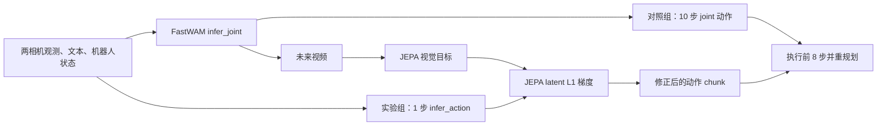

# LIBERO-Plus Long8：1 步 JEPA guidance 与 10 步对照实验

**状态：已完成。** 2026-09-16 18:12:42–18:58:46（Asia/Shanghai），四张 RTX 4090 错峰加载 T5 后运行。结果目录中的 `status.txt=complete`；两组各 32 个结果 JSON，共 64/64 个 episode，未发现 worker 错误。本报告只统计这一轮重跑结果，不混入此前的 core3 实验。

## 1. 研究问题与结论摘要

比较两套完整推理策略在八个 LIBERO-Plus Long Horizon task ID 上的任务完成情况：

|  | 对照组 `ten_control` | 实验组 `one_step_jepa` |
|---|---|---|
| 未来视频 flow denoise | 10 步 | 1 步 |
| 实际执行动作 flow denoise | 10 步 | 1 步，随后 JEPA guidance |
| V-JEPA2-AC | 关闭 | step 0 后施加梯度；不做 Best-of-8 排序 |
| 每次重规划执行动作 | 8 步 | 8 步 |

**总成功率相同：两组均为 14/32（43.75%）。** 在 32 个配对 task–seed 样本中，双方都成功 10 次、双方都失败 14 次、实验组单独成功 4 次、对照组单独成功 4 次。任务间方向不同：实验组在 410、457 上多成功 3 次，在纹理任务 145、158 上少成功 3 次；物体布局任务两组都是 8/8，相机视角任务两组都是 0/8。当前数据不支持“实验组总体成功率更高”的结论。

实验组每次重规划平均耗时 **1.211 s**，对照组 **0.625 s**；平均 episode rollout 耗时分别为 **102.8 s** 和 **57.2 s**。虽然实验组的 flow 步数较少，两次模型调用与 JEPA 梯度计算使它在本配置下更慢。两组同时改变 denoise 步数和 guidance，因此这轮结果不能拆分出两者各自的因果贡献。

## 2. 任务与配对设计

八个 Plus task ID 分别代表八种原始任务目标，每种只选择一个扰动变体。两组使用同一 task ID、同一 Plus 初始状态及相同 seed **7、17、27、37**；每个 task–seed–策略组合运行一次。共 `8 tasks × 4 seeds × 2 strategies = 64 episodes`，即 32 对比较。task 410 和 457 也重新运行，旧实验结果没有并入。

| 原始目标 ID | Plus task ID | 扰动类别 | 目标简述 |
|---:|---:|---|---|
| 1 | 410 | 机器人初始姿态 | 黑碗放入底层抽屉并关上 |
| 7 | 457 | 机器人初始姿态 | 两个杯子分别放到左右盘 |
| 0 | 1945 | 物体布局／干扰物 | 开炉灶并放上 moka pot |
| 4 | 2046 | 物体布局／干扰物 | 汤罐和奶酪盒放入篮子 |
| 3 | 1027 | 相机视角 | 两个 moka pot 放到炉灶上 |
| 8 | 931 | 相机视角 | 白杯放盘上，布丁放盘右侧 |
| 5 | 145 | 背景纹理 | 汤罐和番茄酱放入篮子 |
| 6 | 158 | 背景纹理 | 奶酪盒和黄油放入篮子 |

共同设置：发布版 `libero_uncond_2cam224.pt` checkpoint 与对应 dataset statistics、`sigma_shift=5.0`、`visualize_future_video=true`、`replan_steps=8`、每任务 1 个 trial、夹爪命令二值化。环境允许最多 **700 个策略动作步**；开头另执行 30 个等待动作，这 30 步不计入文中的 `low_level_action_steps`。FastWAM 输出 **32×7** 动作 chunk（6 维运动和 1 维夹爪）；执行前 8 步后重新观测并规划，任务提前完成时最后一个 chunk 不一定执行满 8 步。

实验组实际配置为 `num_inference_steps=1`、`vjepa2_ac.enabled=true`、`candidate_generation_mode=separate`、`guidance.after_flow_steps=[0]`、`guidance.ac_steps=2`、`guidance.step_size=0.02`、`guidance.verify_descent=false`。对照组为 `num_inference_steps=10`、`vjepa2_ac.enabled=false`。两组都生成未来视频；“默认 10 步”在这里仅指 flow 步数，并非直接采用原配置中的 `replan_steps=10`、未来视频关闭。

任务和运行证据：[任务清单](task_lists/libero_plus_long_8_mixed_perturbations.txt)、[启动脚本](../../scripts/run_long8_one_jepa_vs_ten_control.sh)、[原始结果与各 seed 的 manager_config.yaml](../../evaluate_results/long8_one_jepa_vs_ten_control_20260916_long8_4gpu/)。四个 seed 分别在 GPU 0–3 运行；每个 worker 先编码八条任务文本并释放 T5 权重，下一张卡才开始加载 T5。对照组完成后，启动器自动运行实验组。

## 3. 对应模型架构与推理路径

### 3.1 FastWAM

本轮使用两相机 224×224 输入、任务文本和 8 维 proprioception。任务文本由 T5 预编码并缓存；模型配置以 Wan2.2 TI2V-5B 为视频主干，包含 **30 层、hidden size 3072 的视频 DiT** 和 **30 层、hidden size 1024 的动作 DiT**。视频 token 与动作 token 在 joint core 中交互，视频与动作有各自的 flow scheduler。相关配置见 [模型 YAML](../../configs/model/fastwam.yaml) 和 [解析后的运行配置](../../evaluate_results/long8_one_jepa_vs_ten_control_20260916_long8_4gpu/ten_control/seed_7/manager_config.yaml)。

`infer_joint` 在每个 flow step 同时更新未来视频 latent 和一条内部动作 latent。对照组运行 10 步并直接执行其动作输出。实验组的 `infer_joint` 只运行 1 步，其未来视频提供 JEPA 视觉目标；这次 joint 调用内部也产生一条动作，但**不会执行**。实验组随后单独调用 `infer_action`，用 1 个 flow step 和 JEPA guidance 得到真正执行的动作。因此本实验不存在“视频 10 步、动作 1 步”的混合配置。调用路径见 [LIBERO 评测代码](eval_libero_single.py) 与 [FastWAM 推理实现](../../src/fastwam/models/wan22/fastwam.py)。

训练配置 `num_frames=33`，动作与视频频率比为 4:1。每次执行 8 个低层动作，正好对应 JEPA 的两个 action-conditioned transition。

### 3.2 V-JEPA2-AC guidance

实验组加载官方 `vjepa2-ac-vitg.pt` checkpoint，使用冻结的 ViT-G 视觉 encoder 与 action-conditioned predictor。每次重新规划时，encoder 对当前观测片段和 FastWAM 预测未来视频片段编码；两个目标片段分别对齐低层动作 0–3 和 4–7。适配器把归一化动作转换为 JEPA 所需的状态与动作表示。predictor 自回归预测两个 latent transition，能量为两段预测与目标表示的平均 L1 距离：

```text
E(a) = 0.5 × L1(pred_1(a[0:4]), target_1)
     + 0.5 × L1(pred_2(a[0:8]), target_2)
```

动作 flow step 0 后，对估计的 clean action 计算 `∂E/∂a`；仅取前 8 步的梯度，按 RMS 归一化，以 `step_size=0.02` 修正动作。encoder 和 predictor 权重不更新，梯度只用于修改当前生成的动作。每次只生成 **一条**最终动作轨迹，不进行 Best-of-8 候选排序。代码证据：[JEPA 上下文与能量](vjepa2_ac_ranker.py)、[LIBERO guidance 构造](eval_libero_single.py)、[动作梯度更新](../../src/fastwam/models/wan22/fastwam.py)。



## 4. 成功率与配对变化

| Plus task ID | 对照组 10 步 | 实验组 1 步 + JEPA | 配对变化 |
|---:|---:|---:|---|
| 410 | 1/4 | 2/4 | seed 37：失败→成功 |
| 457 | 0/4 | 2/4 | seed 7、27：失败→成功 |
| 1945 | 4/4 | 4/4 | 四个 seed 均成功 |
| 2046 | 4/4 | 4/4 | 四个 seed 均成功 |
| 1027 | 0/4 | 0/4 | 四个 seed 均失败 |
| 931 | 0/4 | 0/4 | 四个 seed 均失败 |
| 145 | 4/4 | 1/4 | seed 7、17、37：成功→失败 |
| 158 | 1/4 | 1/4 | seed 27：失败→成功；seed 37：成功→失败 |
| **总计** | **14/32（43.75%）** | **14/32（43.75%）** | **4 次 rescue、4 次 regression** |

配对四格表：双方都成功 **10**，仅实验组成功 **4**，仅对照组成功 **4**，双方都失败 **14**。如果按两任务一类汇总：初始姿态 **1/8→4/8**，物体布局 **8/8→8/8**，相机视角 **0/8→0/8**，背景纹理 **5/8→2/8**（箭头由对照组指向实验组）。这些类别各只有两个不同任务目标，任务难度与扰动类别交织，不能把类别差异直接解释为对该扰动的普遍鲁棒性差异。

## 5. 动作步数与耗时

| 指标 | 对照组 | 实验组 | 说明 |
|---|---:|---:|---|
| 全部 episode 平均策略动作步 | 522.1 | 535.4 | 失败常跑满 700 步；不含 30 步初始等待 |
| 全部 episode 平均重规划次数 | 65.7 | 67.3 | 每次通常执行 8 步 |
| 成功 episode 平均策略动作步 | 293.3 | 323.9 | 两组成功样本并不完全相同，不能作为严格配对效率差 |
| 双方均成功的 10 对：实验组减对照组动作步 | — | 平均 **+40**；中位 **+12** | seed 145/27 单对差 +271 步，拉高均值 |
| 每次重规划平均耗时 | **0.625 s** | **1.211 s** | 对所有 replan 按次数加权；分别有 2103、2155 次 |
| 每个 episode 平均 rollout 耗时 | **57.2 s** | **102.8 s** | `episode_wall_s`，包含环境步进及重规划 |
| 每个 task 结果平均 `duration` | **96.9 s** | **147.8 s** | 包含评测与结果/视频保存，口径不同于 rollout 耗时 |

重规划内部计时均值：对照组 `infer_joint_s≈0.614 s`；实验组 `infer_joint_s≈0.340 s`，另有 `infer_action_s≈0.694 s`，其余时间包含预处理、JEPA 上下文构造与后处理。实验组平均重规划耗时约为对照组的 **1.94 倍**，平均 episode rollout 耗时约为 **1.80 倍**。两组在同一四卡机器上先后运行，耗时可作本机工程对比；`timing_enabled=true` 会加入 CUDA 同步，且每集耗时不包含 worker 的 T5 加载。

本轮整体墙钟时间为 **46 分 04 秒**，其中对照组约 20 分 17 秒、实验组约 25 分 47 秒。这包含 T5 错峰、模型加载、八任务评测及文件写入；不可直接从每集 `episode_wall_s` 相加得到。

## 6. 解释范围与后续判断

1. **总体成功率打平，行为发生改变。** 4 次 rescue 与 4 次 regression 正好抵消；不能说动作分布相同，也不能说 JEPA 在所有任务上没有影响。
2. **任务间差异大。** 两个物体布局任务在两组均为 8/8，两个相机视角任务均为 0/8；初始姿态任务实验组更好，背景纹理任务对照组更好。这些观察值得分析各 task 的失败视频和中间子目标，但每任务只有 4 个 seed。
3. **当前实验组更慢。** 把 flow 降至 1 步没有抵消单独的 `infer_action` 调用和 JEPA guidance 计算；若关心推理效率，应以完整重规划耗时而非 denoise 步数作为指标。
4. **不能做单因素归因。** 两组同时改变视频和动作 denoise 步数、JEPA guidance，以及实验组使用单独动作调用的推理路径。若要单独估计 JEPA 贡献，需要相同 1 步设置下的无 JEPA 对照；若要单独估计 denoise 步数贡献，需要保持 guidance 等其他因素一致。
5. **样本量限制。** 32 对、每任务 4 个 seed 适合发现具体任务的 rescue/regression，不足以证明跨变体或跨扰动类别的稳定优势。最终结论应限定为本轮八个固定 Plus ID。

原始证据索引：[对照组结果](../../evaluate_results/long8_one_jepa_vs_ten_control_20260916_long8_4gpu/ten_control/)、[实验组结果](../../evaluate_results/long8_one_jepa_vs_ten_control_20260916_long8_4gpu/one_step_jepa/)、[完成状态](../../evaluate_results/long8_one_jepa_vs_ten_control_20260916_long8_4gpu/status.txt)。
